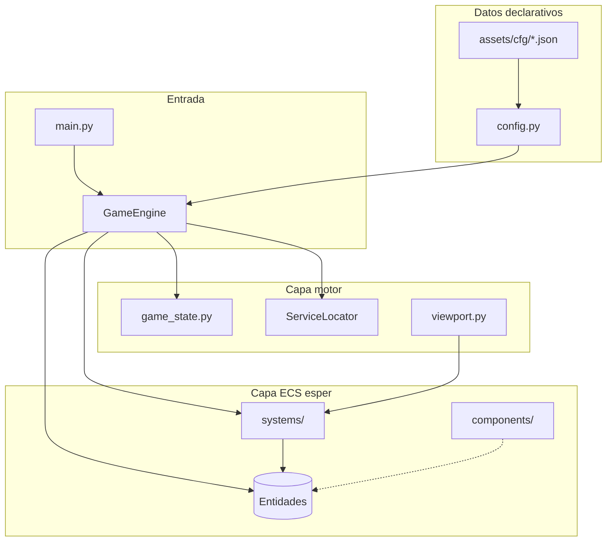
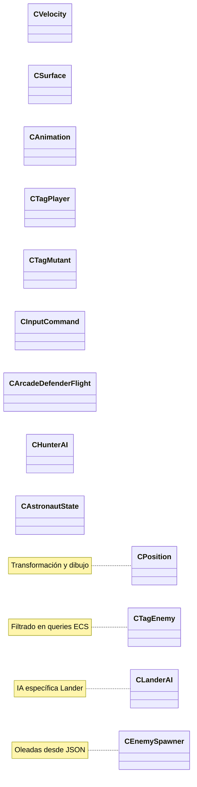
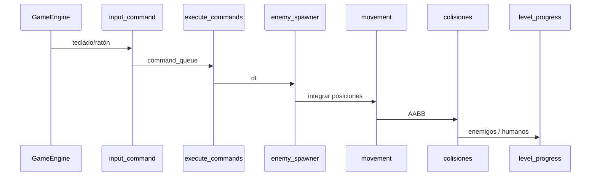
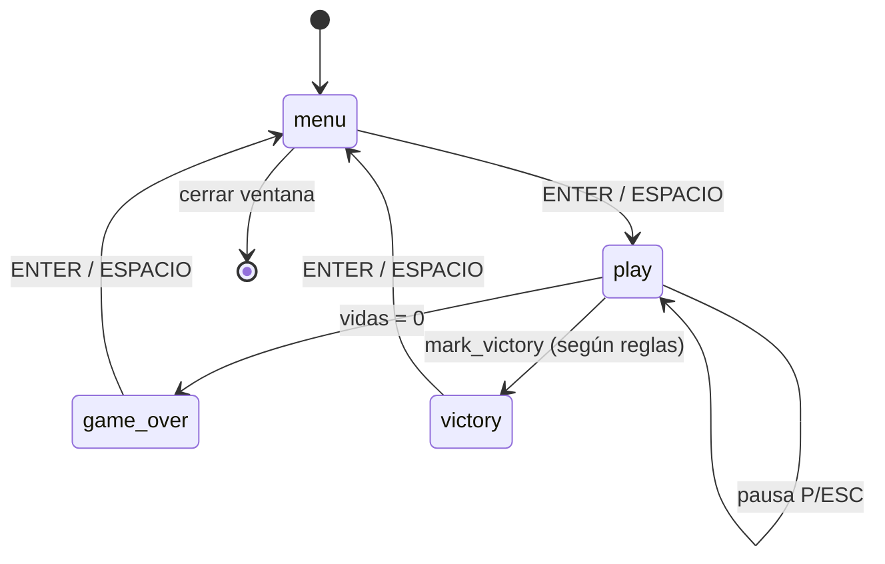

# Análisis de arquitectura y post-mortem del proyecto

**Grupo:** Proyecto final Defender  
**Curso:** MISW-4407 — Introducción al desarrollo de videojuegos  
**Integrantes:** Leonardo L. Rueda · Miguel Angel Moreno Páez · Héctor López  
**Fecha:** mayo 2026  

Documento de entrega grupal: resume el proceso de desarrollo, analiza la arquitectura del clon *Defender*, describe los patrones empleados (en especial **ECS**) y cierra con una reflexión honesta sobre aciertos, fallos y mejoras futuras.

**Documentos relacionados:** [`avance-equipo.md`](avance-equipo.md) · [`guia-sustentacion.md`](guia-sustentacion.md) · [`archivos-del-repositorio-sustentacion.md`](archivos-del-repositorio-sustentacion.md) · carpeta [`arquitectura/`](arquitectura/).

---

## 1. Resumen del proceso de desarrollo

### 1.1 Objetivo y enfoque

El proyecto busca una **réplica cercana al arcade *Defender*** (Williams, 1981), no un shooter genérico. La docencia exige **ECS**, patrones vistos en clase (Game Loop, Command, Service Locator, configuración externa) y un volumen amplio de mecánicas (menú, parallax, wrap, Landers/Mutants, HUD, publicación en portal, etc.).

El equipo adoptó desde el inicio una **separación motor / juego**:

- **Motor** (`src/engine/`): ventana Pygame, carga de JSON, `GameEngine`, estado de sesión (`game_state`), servicios de assets.
- **Juego ECS** (`src/ecs/`): componentes (datos) y sistemas (lógica por frame).

Eso permitió repartir trabajo por **zonas de archivo** (jugador vs escenario/enemigos) y balancear el juego editando **`assets/cfg/`** sin recompilar toda la lógica.

### 1.2 Evolución semanal (alineada a avances MISW)

La tabla siguiente resume **qué se hizo en cada etapa** y el resultado observable al correr `python3 main.py`. Las fechas son orientativas según el calendario del curso; el detalle de checklists está en [`avance-equipo.md`](avance-equipo.md).

| Semana / avance | Foco principal | Acciones del equipo | Resultado en el producto |
|-----------------|----------------|---------------------|---------------------------|
| **Avance 1** | Escenario ECS | Lectura de `world.json`; entidades de estrellas y planeta procedural; sistemas `system_scenario_*`; registro en `GameEngine` del orden fondo → sprites. | Fondo con parallax y relieve; base visual Defender antes de mecánicas completas. |
| **Avance 2** | Nave + Command | Pipeline **input → `CInputCommand` → Command → `system_execute_commands`**; movimiento con límites; primer disparo; pausa estable sobre el escenario. | Jugador controlable con sensación inicial; **aún no** clon Defender cerrado. |
| **Avance 3** | Mundo horizontal | `system_world_wrap`, mundo ancho (`world_play_width_px`), cámara (`system_camera_follow`), `viewport.py` para visibilidad. | Cruce borde-a-borde tipo arcade; playtest formal **pendiente de registrar** en bitácora. |
| **Avance 4** | Astronautas | Spawns en `level_01.json`; gravedad/aterrizaje; `planet_edge_screen_y` alineado al relieve. | Humanos visibles sobre el planeta; base para rescate y rapto. |
| **Avance 5** | Landers | IA `system_lander_ai`, disparo solo con jugador en vista; defs en `enemies.json` + spawner. | Combate lander reconocible; arte/SFX finales **parciales**. |
| **Avance 6** | Rapto y mutante | Estados `CAstronautState` / `CLanderAI`; mutación (`system_lander_mutation`, `mutate_spawn`); puntos rescate en reglas. | Mini-historia Defender (secuestro → mutante → rescate). |
| **Avance 7** | Colisiones | Balas rivales, misiles mutante, friendly fire astronautas; `enemy_kill_score.py` centraliza puntos. | Sesión larga sin hitboxes “imposibles” en lo esencial; explosiones aún genéricas. |
| **Avance 8** | HUD y estados | `game_phase` (menú / play / game over / victoria); HUD puntos/MÁX/vidas/bombas/enemigos/mutantes; pausa con overlay; fanfare opcional. | Producto demostrable en clase; récord en `userdata/high_score.json`. |
| **Avance 9** *(cierre)* | Entrega y paridad | Menú inicial; modo **arcade_defender_flight** (thrust, smart bomb, hyperspace, radar); oleadas superficie⇄espacio; polish sprites/audio. | Jugabilidad **bastante cerrada**; **pendiente**: itch.io, checklist vídeo/enunciato, audio cohorte en masa. |

### 1.3 Organización del trabajo en el equipo

| Integrante | Responsabilidad principal |
|------------|---------------------------|
| **Leonardo L. Rueda** | Entrada, **Command**, sistemas del jugador (`system_player_*`, `frame_input`), límites y animación de la nave. |
| **Héctor López** | **GameEngine**, escenario, spawner, IA enemiga (Landers, Hunter/mutante, bomber, baiter), colisiones del lado enemigo, progresión de nivel arcade. |
| **Miguel Angel Moreno Páez** | Coordinación, revisión cruzada y alineación con entregables; evita duplicar la línea de enemigos en paralelo. |

**Regla anti-conflicto:** cada avance asigna **carpetas preferentes**; cambios en `game_engine.py` (orden de sistemas) los coordina quien lleva el motor.

### 1.4 Estado al cierre del informe

- **Listo para demo técnica:** motor ECS, modo defensa arcade, smart bomb, radar, HUD, menú, persistencia de récord, variedad de enemigos vía JSON.
- **No listo para rúbrica completa de publicación:** build **itch.io**, página con descripción/captura, checklist formal frente al vídeo de referencia.
- **Falta revisar en grupo:** playtest wrap documentado, balance de `level_01.json`, condición de victoria vs expectativa docente en modo arcade largo.

---

## 2. Análisis arquitectónico

### 2.1 Visión general

La arquitectura es un **motor delgado + mundo ECS**. No hay jerarquía profunda de clases `GameObject`/`Enemy`/`Lander`; en su lugar hay **entidades** (IDs numéricos en `esper`) con **componentes** pegados y **sistemas** que procesan conjuntos de componentes cada frame.

**Por qué esta organización**

1. **Cumplir el enunciado ECS** sin mezclar dibujo, física e IA en una sola clase monolítica.
2. **Escalar mecánicas Defender** (cada criatura = componentes + sistemas existentes o nuevos) sin reescribir el motor.
3. **Facilitar el trabajo en paralelo**: Leonardo en pipeline jugador; Héctor en spawner, escenario y reglas de nivel.
4. **Data-driven design**: oleadas, puntos y reglas en JSON → diseñadores del equipo ajustan sin tocar Python.

### 2.2 Capas y responsabilidades

| Capa | Ubicación | Responsabilidad | ¿Por qué no otra cosa? |
|------|-----------|-----------------|-------------------------|
| **Entrada** | `main.py` | Arranque mínimo | Un solo punto de entrada claro para docencia y despliegue. |
| **Orquestación** | `game_engine.py` | Loop Pygame, fases (`menu`/`play`/fin), orden update/draw, HUD motor | Centraliza dependencias entre sistemas; alternativa (cada sistema se auto-registra) sería más difícil de depurar en curso. |
| **Estado de sesión** | `game_state.py` | Puntaje, vidas, fase defensa, cámara, flags globales | Transversal a HUD y parsers; un componente ECS “singleton mundo” sería más ceremonioso para el tamaño del proyecto. |
| **Carga de datos** | `config.py`, `enemy_defs.py` | JSON → objetos Python / componentes iniciales | Evita hardcodear 50 parámetros de enemigos en código. |
| **Recursos** | `service_locator.py`, `resource_services.py` | Texturas, sonidos, fuentes | Patrón exigido por el curso; desacopla rutas de assets de la lógica. |
| **Datos por entidad** | `src/ecs/components/` | Solo estado (posición, tags, IA lander, etc.) | Principio ECS: datos ≠ comportamiento. |
| **Comportamiento** | `src/ecs/systems/` | Una responsabilidad por archivo, invocado en orden fijo | Testeable mentalmente (“¿falla colisión? → miro `system_collision_*`”). |
| **Utilidades transversales** | `viewport.py`, `enemy_kill_score.py`, `scenario_profile.py` | Reglas compartidas (visibilidad, puntos, altura del suelo) | Evita duplicar la misma fórmula en diez sistemas. |

### 2.3 Organización de componentes

Los componentes son **structs livianos** (clases o dataclasses) sin lógica de juego pesada. Se agrupan por rol:

| Familia | Ejemplos | Uso |
|---------|----------|-----|
| **Transformación / render** | `CPosition`, `CVelocity`, `CSurface`, `CAnimation`, `CSize`, `CColor` | Cualquier cosa que se mueve o se dibuja. |
| **Tags** | `CTagPlayer`, `CTagEnemy`, `CTagMutant`, `CTagLander`, `CTagHud` | Consultas rápidas en sistemas sin `isinstance`. |
| **Jugador** | `CInputCommand`, `CArcadeDefenderFlight`, `CPlayerArcadeBurner`, `CShieldSpecial` | Modo arcade vs modo escudo legacy según `player.json`. |
| **Escenario** | `CScenarioStarfield`, `CScenarioPlanetProfile` | Fondo procedural desacoplado del gameplay. |
| **IA enemiga** | `CLanderAI`, `CHunterAI`, `CPodCargo`, `CBomberDrop` | Comportamientos distintos sin subclases de `Enemy`. |
| **Nivel / metajuego** | `CEnemySpawner`, `CBulletDef`, `CExplosionConfig` en entidad portadora | Un solo lugar con defs de disparo y explosión del nivel. |

**Decisión:** usar **tags** en lugar de un campo `enemy_type: str` en un solo componente, porque varios sistemas solo necesitan “¿es enemigo?” o “¿es mutante?” sin conocer el catálogo completo.

### 2.4 Organización de sistemas y orden de ejecución

El orden no lo decide `esper` automáticamente: **`GameEngine._update_play()`** llama sistemas en una **lista manual** (pipeline). Eso es una decisión consciente: las dependencias entre fases (entrada → física → colisión → HUD) son explícitas.

**Agrupación actual (simplificada)**

| Fase | Sistemas representativos |
|------|---------------------------|
| Entrada y habilidades arcade | `system_input_command`, `system_execute_commands`, `system_arcade_hyperspace`, `system_arcade_smart_bomb` |
| Producción y tiempo | `system_enemy_spawner`, `system_arcade_wave_time`, `system_arcade_baiter_spawn` |
| IA y astronautas | `system_lander_ai`, `system_hunter_ai`, `system_mutant_missile`, `system_astronaut_*`, `system_bomber_drop_bombs` |
| Integración espacial | `system_movement`, `system_world_wrap`, `system_camera_follow`, `system_player_bounds` |
| Colisiones y progresión | `system_collision_*`, `system_defense_arcade_transition`, `system_level_progress` |
| Presentación | `system_scenario_draw`, `system_draw`, `system_draw_radar_defender` (+ HUD en motor) |

**Riesgo documentado:** insertar un sistema nuevo en el lugar incorrecto puede romper supuestos (p. ej. colisión antes de mover). Por eso el equipo mantiene [`arquitectura/sistemas.md`](arquitectura/sistemas.md) como referencia viva.

### 2.5 Flujo de estados del juego (no es un SceneManager formal)

- **`game_phase`** en `game_state.py` coordina menú, partida y pantallas finales.
- **No** hay clases `MenuScene` / `PlayScene` separadas: el motor alterna overlays y recarga ECS con `_reload_play_world()`.
- **Decisión:** priorizar **entregar mecánicas Defender** antes que un framework de escenas completo; la deuda es aceptable para el alcance del curso pero se reconoce en post-mortem.

### 2.6 Configuración externa

| Archivo | Rol arquitectónico |
|---------|-------------------|
| `window.json` | Desacopla resolución y FPS del código. |
| `world.json` | Parámetros del escenario sin recompilar. |
| `game_rules.json` | Reglas de negocio (puntos, smart bombs, escalas visuales, ancho mundo). |
| `player.json` | Alterna modo arcade vs escudo legacy. |
| `enemies.json` | Catálogo de especies (datos, no clases). |
| `level_01.json` | **Nivel = datos**: spawns temporizados y `defense_arcade` (superficie + oleadas espacio). |

**Beneficio medido en el proyecto:** ajustar densidad de oleadas y puntuación en iteraciones tardías (smart bomb, HUD, récord) **sin** tocar la estructura ECS.

### 2.7 Decisiones arquitectónicas destacadas (con justificación)

| Decisión | Alternativa descartada | Motivo |
|----------|------------------------|--------|
| **ECS con `esper`** | Jerarquía OO `Enemy` → `Lander` → … | Muchas combinaciones (pod + animación + tag + IA); composición más flexible. |
| **Command para movimiento/disparo** | Leer teclas directamente en `system_movement` | Cumple patrón del curso; separa intención de ejecución; facilita pruebas mentales del pipeline. |
| **Service Locator** | Cargar `pygame.image` en cada sistema | Una política de rutas y caché; menos duplicación. |
| **`game_state` global acotado** | Todo en componentes | HUD, cámara y parser de nivel necesitan lectura rápida; el módulo está documentado y es pequeño. |
| **Viewport separado** | Culling inline en cada sistema de dibujo/colisión | Smart bomb y láser “solo en vista” comparten la misma regla que el radar. |
| **Orden manual de sistemas** | Sistema de prioridades automático | Más transparente para estudiantes y para la sustentación oral. |

---

## 3. Patrones usados

### 3.1 Entity–Component–System (ECS)

**Qué es:** las entidades son identificadores; los **componentes** almacenan datos; los **sistemas** implementan comportamiento iterando sobre entidades que tienen ciertos componentes.

**Cómo lo usamos:** biblioteca **`esper`** en Python. Ejemplo real del flujo lander:

1. El spawner crea una entidad con `CPosition`, `CVelocity`, `CSurface`, `CLanderAI`, `CTagEnemy`, `CTagLander`.
2. Cada frame, `system_lander_ai` lee posición del jugador y actualiza fase de captura/disparo.
3. `system_draw` dibuja todo lo que tenga `CPosition` + `CSurface` sin saber que es un Lander.

**Relevancia en videojuegos (y más allá)**

| Contexto | Por qué ECS encaja |
|----------|-------------------|
| **Arcade con muchos tipos** (*Defender*, *Gauntlet*, bullet hell) | Nuevos enemigos = nuevos componentes/tags, no árboles de herencia frágiles. |
| **Prototipado rápido** | Diseñador cambia JSON; programador añade un sistema pequeño. |
| **Rendimiento en motores grandes** (Unity DOTS, Bevy, entt) | Misma idea: datos contiguos, sistemas paralelizables. |
| **Simulaciones** | Entidades heterogéneas (agentes, recursos, obstáculos) con reglas por sistema. |

**Limitación que vivimos:** sin disciplina, el **orden del pipeline** y el **`game_state` global** pueden convertirse en “dependencias ocultas”. La mitigación fue documentar orden en `game_engine.py` y en `docs/arquitectura/`.

### 3.2 Game Loop

Patrón clásico **input → update → render**, implementado en `GameEngine.run()`:

- `_calculate_time()` → `delta_time`
- eventos Pygame (pausa, salida)
- `_update_play()` si no hay pausa
- `_draw_play()` + overlays (pausa, smart bomb, game over)

En pausa, **update ECS se omite** pero **draw continúa**: el jugador ve el mundo congelado con overlay, como pide la rúbrica.

### 3.3 Command

- **`system_input_command`:** traduce hardware a objetos `PlayerLeftCommand`, `PlayerFireCommand`, etc. (`commands.py`).
- **`system_execute_commands`:** ejecuta la cola y modifica `CVelocity`, crea balas, activa thrust en modo arcade.

**Ventaja en juegos:** desacopla **dispositivo de entrada** (teclado hoy, gamepad mañana) de **reglas de simulación**. En redes o replay, la cola de comandos podría serializarse (no lo hicimos, pero es el mismo patrón).

### 3.4 Service Locator

`ServiceLocator` registra `textures`, `sounds`, `fonts` al iniciar el motor. Los sistemas piden `ServiceLocator.current().get("textures").load(path)`.

**Uso en el proyecto:** jugador, explosiones, burner, sprites de pod/swarmer/bomber.  
**Crítica conocida:** el Locator puede ocultar dependencias si se abusa; aquí el conjunto de servicios es **pequeño y estable**, aceptable para el alcance del curso.

### 3.5 Configuración externa (data-driven)

No es un patrón GoF clásico, pero es **decisión arquitectónica central**: el juego es en gran parte **interpretación de JSON** en `config.py` + aplicación en sistemas.

### 3.6 State (parcial)

- **Pausa:** flag `paused` en `game_state` — subconjunto del patrón State.
- **Fases de juego:** `game_phase` (`menu`, `play`, `game_over`, `victory`) — máquina de estados **ligera** en el motor, no como clases State por archivo.

### 3.7 Otros patrones menores

| Patrón | Dónde | Rol |
|--------|-------|-----|
| **Object pool** *(implícito)* | Reutilización de entidades vía `esper.delete_entity` / `create_entity` | Explosiones y balas se crean/destruyen cada evento; pool sería optimización futura. |
| **Factory** | `scenario_factory.create_scenario_entities`, `mutate_spawn.spawn_mutant_at` | Creación encapsulada de entidades complejas. |
| **Singleton** *(de facto)* | `ServiceLocator._instance`, módulo `game_state` | Punto único de acceso; documentado como trade-off. |

### 3.8 Comparación breve: ECS vs enfoque orientado a objetos

| Aspecto | ECS (nuestro proyecto) | OO clásica (`class Lander(Enemy)`) |
|---------|------------------------|-------------------------------------|
| Añadir “Bomber que suelta bombas animadas” | Componente `CBomberDrop` + `system_bomber_drop_bombs` | Nueva subclase + override de `update()` |
| Compartir lógica de explosión | Un `spawn_explosion` + tags | Posible duplicación o mixins |
| Curva de aprendizaje | Orden de sistemas + queries | Herencia profunda en proyectos grandes |
| Depuración | “¿Qué sistema tocó la entidad 42?” | “¿Qué método virtual?” |

---

## 4. Reflexión (post-mortem)

### 4.1 ¿Qué salió bien?

1. **Separación motor / ECS / JSON**  
   Permitió que Leonardo avanzara en jugador mientras Héctor integraba landers, oleadas y escenario, con merges razonables. Los ajustes tardíos de balance (más spawns en `level_01.json`, `sprite_draw_scale`) no requirieron reescribir el motor.

2. **Pipeline Command + sistemas pequeños**  
   En la sustentación es fácil explicar: “primero input, luego comandos, luego física, luego colisiones”. Los bugs localizados (p. ej. smart bomb duplicando IDs de bombas con doble tag) se corrigieron en **un sistema** (`system_arcade_smart_bomb`) sin efectos dominó.

3. **Paridad Defender progresiva**  
   Pasar de prototipo Hunter a landers, rapto, mutante, modo defensa superficie/espacio y HUD arcade demuestra que la arquitectura **aguantó crecimiento** sin reescritura total.

4. **Documentación paralela al código**  
   `avance-equipo.md`, FAQ cruzado, guías de sustentación y este informe reducen dependencia de “solo quien escribió el código lo sabe”.

5. **Persistencia de récord y HUD unificado**  
   Centralizar puntaje en `enemy_kill_score` y récord en `record_high_score_if_best` evitó inconsistencias que ya habían aparecido entre láser, bomba y embestida.

### 4.2 ¿Qué salió mal o costó más de lo esperado?

1. **Orden manual de sistemas**  
   Al crecer `_update_play()`, cualquier sistema nuevo exige **leer todo el pipeline**. Hubo bugs por asumir orden (colisión vs movimiento) que en OO estarían en un solo `update()` de entidad.

2. **`game_state` global**  
   Simplificó HUD y transiciones, pero **acopla** sistemas al módulo global; tests automatizados serían más limpios con un objeto `Session` inyectado.

3. **Documentación de arquitectura desactualizada en puntos**  
   Algunos archivos en `docs/arquitectura/` (p. ej. `estado-general.md`, `flujo-de-juego.md`) se escribieron cuando aún no existían menú ni modo defensa; generaron confusión interna hasta alinear con `avance-equipo.md`.

4. **Audio y arte cohorte incompletos**  
   Muchas rutas en JSON siguen vacías; el juego **funciona** pero no cumple la sensación sonora del arcade ni la rúbrica de “assets finales en masa”.

5. **Entrega pública tardía**  
   itch.io y checklist vídeo/enunciato quedaron al final; el riesgo es concentrar QA y publicación en pocos días.

6. **Bug real que ilustra deuda ECS:** smart bomb intentaba borrar la misma entidad dos veces porque las bombas del bomber tenían **dos tags de enemigo**; la lección fue deduplicar víctimas en el sistema, no “arreglar solo en colisión láser”.

### 4.3 ¿Qué se puede cambiar en el futuro?

| Mejora | Acción concreta | Beneficio esperado |
|--------|-----------------|-------------------|
| **Gestor de escenas** | `SceneManager` con `MenuScene`, `PlayScene`; cada una registra su subconjunto de sistemas | Menú/game over más claros; menos lógica condicional en `GameEngine` |
| **Registro de sistemas con fases** | Enum `Phase.INPUT`, `Phase.PHYSICS`, … y lista ordenada en datos | Añadir sistemas sin editar 80 líneas a mano |
| **Tests de humo** | Script que corre N frames con `SDL_VIDEODRIVER=dummy` y assert de `game_phase` / conteo enemigos | Detectar regresiones en CI antes de demo |
| **Object pool** para balas/explosiones | Menos presión al GC de Python en sesiones largas | Estabilidad de FPS en web (pygbag) |
| **Checklist vivo** | Un markdown “enunciato ↔ código ↔ probado sí/no” actualizado cada sprint | Cierra Avance 9 y defiende paridad FAQ sin sorpresas |
| **Pipeline itch** | README con comando pygbag/pyinstaller + captura obligatoria en PR | Cumple rúbrica de URL con descripción |
| **Reducir `game_state`** | Mover fase defensa y cámara a componente singleton `CWorldSession` en ECS | Mejor testabilidad manteniendo ECS puro |

### 4.4 Lecciones para otros proyectos con ECS en el curso

- Definir **desde el avance 2** el orden de fases del frame y documentarlo.
- Tratar JSON como **contrato**: cambios en `level_01.json` deben probarse en partida de 5 minutos.
- No postergar **menú + game over** al último avance: el motor ya soporta `game_phase`, pero la experiencia de producto depende de pulirlos pronto.
- Mantener **un solo documento de verdad** para “hecho / pendiente” (`avance-equipo.md`) y derivar informes desde ahí.

---

## 5. Cierre

El proyecto demuestra una arquitectura **ECS pragmática** acorde a MISW-4407: motor Pygame delgado, datos en JSON, comportamiento en sistemas ordenados, y patrones Command + Service Locator + Game Loop visibles en el código. La réplica *Defender* pasó de escenario + nave a un **modo arcade con oleadas, economía de puntos y HUD** reconocible.

Quedan trabajos de **producto** (portal, audio masivo, checklist de fidelidad) más que de **replantear la arquitectura**. Las mejoras futuras apuntan a **escenas formales**, **menos estado global** y **automatización de pruebas**, sin abandonar la composición por componentes que permitió llegar al estado actual.

---

*Referencias internas:* [`src/engine/game_engine.py`](../src/engine/game_engine.py) · [`docs/arquitectura/arquitectura-ecs.md`](arquitectura/arquitectura-ecs.md) · [`docs/referencia-mecanicas-defender-faq.md`](referencia-mecanicas-defender-faq.md)
