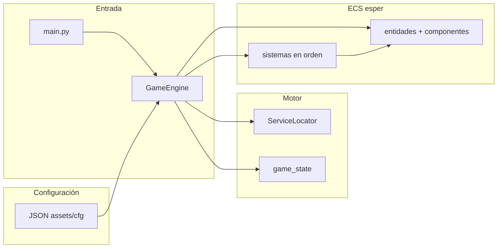

# Guía para la sustentación del proyecto (Defender‑style arcade)

Este documento resume **qué existe en el repo**, **cómo encaja**, y **qué pueden decir en viva voz** sin tener que revisar archivo por archivo durante la exposición.

---

## 1. Elevator pitch (30–45 s)

- **Qué es:** un clon de estilo **Defender** sobre **Pygame CE**, con motor propio usando **ECS (esper)**: datos en componentes, lógica en sistemas ejecutados en orden fijo cada frame.
- **Qué permite el diseño:** JSON en `assets/cfg/` para ventana, reglas de juego, jugador, enemigos, nivel y UI; así se **balancea** y se **añaden oleadas** sin recompilar.
- **Diferenciador técnico:** mundo horizontal **ancho** con **wrap** (toro), **cámara** centrada en el jugador, **viewport** sólo‑vista para smart bomb/radar; **modo arcade** (`arcade_defender_flight`) con hyperspace, smart bombs, ciclo superficie⇄espacio según nivel.

---

## 2. Cómo correr el juego

```bash
pip install -r requirements.txt
python3 main.py
```

Carpeta de configuración alternativa:

```bash
python3 main.py /ruta/a/cfg
```

Por defecto se usa **`assets/cfg/`** (raíz del repo en `GameEngine`; ver `main.py`).

---

## 3. Mapa mental del repositorio

| Ruta | Rol |
|------|-----|
| `main.py` | Punto de entrada: construye `GameEngine` y llama `run()`. |
| `src/engine/` | Motor: ventana, carga JSON, **`game_state`** global de sesión, **Service Locator** (texturas, sonido, fuentes), **`GameEngine`** (loop, menú, fases, HUD). |
| `src/ecs/components/` | Datos por entidad: posición, velocidad, tags (`CTagEnemy`, `CTagPlayer`, …), IA (lander, hunter), configuración de balas/explosion. |
| `src/ecs/systems/` | Comportamiento: input, movimiento, spawner, colisiones, dibujo, progresión de nivel. |
| `assets/cfg/*.json` | Datos declarativos (ventana, `game_rules`, `player`, `enemies`, `level_01`, `world`, `interface`, …). |
| `assets/img/`, audio referenciado en JSON | Arte y SFX citados desde config. |
| `userdata/high_score.json` | Récord persistente (`best`). |

---

## 4. Arquitectura en una frase + diagrama

**Frase:** *El loop de Pygame pide cada frame una actualización de datos (ECS) y un dibujado ordenado (escenario → entidades → overlays → HUD); el estado entre menú/partida/victoria lo coordina `GameEngine` y variables en `game_state`.*



---

## 5. Fases del juego (`game_phase`)

Gestión principal en **`src/engine/game_engine.py`** (aproximado):

| Fase | Comportamiento |
|------|----------------|
| **`menu`** | Pantalla inicial, fondo de escenario opcional; **ENTER / ESPACIO** cargan nivel (`_reload_play_world`). |
| **`play`** | Bucle ECS: `_update_play()` → `_draw_play()`; pausa **P / ESC**. |
| **`game_over` / `victory`** | Banner; teclas para volver al menú o salir según texto en pantalla. |

**Construcción de partida** (`_reload_play_world`): `esper.clear_database()`, cargar reglas/world/player/enemigos/spawner desde `config.py`, crear entidades de escenario (`scenario_factory.create_scenario_entities`), jugador, HUD estático/dinámico, y registrar flags en **`game_state`** (arcade vs escudo, `defense_arcade_*`, dimensiones mundo, etc.).

---

## 6. Estado global `game_state` (`src/engine/game_state.py`)

No es ECS “puro”—concentra datos de sesión útiles para muchos sistemas:

- **Económica:** `score`, `lives`, smart bombs arcade, milestones de vida extra (según `game_rules`).
- **Nivel Defender:** `defense_arcade_enabled`, `defense_phase` (superficie vs espacio), `space_wave_index`, temporizadores, banderas de baiter por oleada, etc.
- **Cámara y mundo:** `camera_scroll_x`, `world_wrap_w`, tamaño pantalla, bandas de jugabilidad vertical (`play_area_*`).
- **UX:** flashes (`planet_explosion_flash_remaining`, `smart_bomb_flash_remaining`), jugador detrás del relieve (`player_occluded_by_terrain`).
- **High score:** `high_score_saved`, `load_high_score_from_disk()`, `record_high_score_if_best()`, `high_score_best_display()` para el HUD **MÁX**.

Ventaja para la sustentación: “**parte del estado deliberadamente es global** porque es transversal al HUD, al parser de nivel y a varios sistemas; el resto está en componentes ECS”.

---

## 7. Service Locator

**`src/engine/service_locator.py`** + **`resource_services.py`**: después de `_bind_services()` en el motor hay `textures`, `sounds`, `fonts`. Las rutas son relativas a la **raíz del proyecto**.

---

## 8. ECS: filosofía

- **`esper`:** entidades = IDs; comportamiento por **consultas** (qué componentes tiene cada entidad).
- **Sin herencia pesada de “clase Enemigo”:** tipos divergentes por **conjuntos de componentes** + **tags**.
- **Orden importa:** en `_update_play()` el orden de llamadas está **fijado** en `game_engine.py`; cambiar ese orden puede romper dependencias (p. ej. movimiento antes que colisión).

---

## 9. Orden de sistemas en partida (_update_play_) — agrupado

Referencia línea-base: `GameEngine._update_play` en `game_engine.py`.

| Bloque | Sistemas (idea) |
|--------|------------------|
| Mundo vivo | Escenario procedural/scroll, input, comandos, hyperspace, smart bomb |
| Producción | Spawner oleadas, tiempo de oleadas arcade, baiter tardío |
| IA enemigos | Hunter, misiles mutant, lander AI, gravedad astronautas |
| Integración física simple | Movimiento, bombas bomber, rescate astronauts, wrapping, límites jugador |
| Vista | Cámara, oclusión terreno jugador |
| Derivados | Rebotes, límites balas, animaciones, escudo (modo no arcade) |
| Colisiones | Balas entre sí, bala↔enemigo, bala↔astrónauta, jugador↔enemigo, disparos enemigos↔jugador |
| Estado macro | Transición modo defensa arcade, explosiones, HUD dinámico, flashes |

**Draw** (`_draw_play`): escenario → entidades/sprites → escudo/anillos → overlays explosión/smart bomb → **radar Defender** → franja HUD (puntos, MÁX, enemigos, mutantes, fase nivel).

---

## 10. Mundo horizontal, cámara y viewport

- **`world.json` / reglas:** ancho jugable grande (`world_play_width_px`), wrap horizontal.
- **`system_camera_follow`:** mueve **`game_state.camera_scroll_x`** tras el jugador.
- **`src/engine/viewport.py`:** dado cámara y ancho mundo, decide si algo **debe dibujarse** (incluye copias por wrap). Smart bomb/radar pueden limitarse a vista sin cambiar física global.

Para decir en sustentación: *“Separamos **mundo simulado** y **rectángulo visible** para que el comportamiento Defender (láser sólo vista) sea configurable.”*

---

## 11. Input y comandos arcade

Flujo típico:

1. **`system_input_command`:** lee teclado/pygame según modo.
2. **`CInputCommand`** en la entidad jugador.
3. **`system_execute_commands`:** interpreta comandos según **`CArcadeDefenderFlight`** o componentes legacy (escudo, ratón si aplica).

**`player.json`:** `arcade_defender_flight: true` activa thrust/reverse/smart bomb/espacio; combustible burner opcional (`player_burner_*` sprites) vía **`CPlayerArcadeBurner`** + dibujo detrás en `system_draw`.

---

## 12. Configuración clave por archivo JSON

| Archivo | Para qué |
|---------|----------|
| `window.json` | Resolución, FPS, fullscreen, fondo |
| `game_rules.json` | Vidas, puntuaciones, escalas dibujo/radar, parámetro arcade thrust/drag/bomba bomber, flashes, bonus oleada superficie |
| `player.json` | Sprite o rectálogo, velocidad, modo arcade y rutas burner |
| `enemies.json` | Definición por `type`: lander/hunter/pod/baiter/bomber/mutant/etc. rutas sprite y parámetros |
| `level_01.json` | `defense_arcade` (lista superficie + `space_waves`), spawns tiempo/posición, astronautas |
| `world.json` | Planet profile, scroll, tamaño mundo |
| `interface.json` | Fuentes, textos HUD estáticos |
| `bullet.json`, `explosion.json`, `special.json` | Disparos, explosiones, modo escudo (si no arcade) |

---

## 13. Spawn de enemigos

- Una entidad spawner lleva **`CEnemySpawner`**: lista de eventos tiempo/tipo/posición.
- **`system_enemy_spawner`:** dispara cuando el reloj alcanza cada evento (`clone_spawn_events` para repetir superficie tras ciclo).
- **`build_enemy_spawner_component`** en **`config.py`:** escala Y de spawn respecto altura referencia (**256 px**) para otros tamaños de ventana.

Para la expo: “**Oleadas declarativas** + **replay** cuando el nivel pide nueva oleada superficie”.

---

## 14. Progresión nivel y ciclo Defender

- **`system_defense_arcade_transition`:** alterna superficie ↔ oleadas espaciales según reglas nivel.
- **`system_level_progress`:** cuenta enemigos, humanos vivos y decide victoria bonificada vs **reload** de superficie (loop estilo Defender con humanos vivos).

---

## 15. Colisiones y puntaje

| Interacción | Dónde aproximar (sistema) |
|-------------|---------------------------|
| Balas jugador ↔ enemigo | `system_collision_bullet_enemy` |
| Balas jugador ↔ balas enemigas | `system_collision_bullet_enemy_bullet` |
| Jugador ↔ enemigo | `system_collision_player_enemy` |
| Misiles/disparos enemigos ↔ jugador | `system_collision_enemy_bullet_player` |

Puntos: **`enemy_kill_score.py`** (`score_for_destroyed_enemy`) usado donde haya destrucción coherente (incluye smart bomb, choque nave, etc.). **`game_state.add_score`** y **`record_high_score_if_best`** en hitos pertinentes.

---

## 16. Elementos destacables para demos en vivo

1. **Menú → partida** y reinicio rápido.  
2. **Wrap** navegando hasta el borde invisible del mundo vs cámara.  
3. **Rescates / landers que capturan / mutación** (`system_lander_mutation`, `mutate_spawn`) según nivel.  
4. **Radar** inferior y marcadores.  
5. **Smart bomb** (stock, flash, wipes en viewport donde aplique código).  
6. **Oleada SUPERFICIE vs OLA ESP n/n** en barra HUD.  
7. **HIGH SCORE persistente**: cerrar juego / nueva partida y mostrar **`userdata/high_score.json`**.

---

## 17. Dividir la palabra entre integrantes (sugerencia)

| Tema corto | Contenido |
|------------|-----------|
| **Leonardo — Input→comando** | `frame_input`, `system_input_command`, `system_execute_commands`, animaciones jugador, feedback de movimiento. |
| **Héctor — Motor + nivel** | `GameEngine` loop/fases, `config` JSON, scenario/planet, viewport/cámara, spawner/defense arcade, HUD y `game_state`, colisiones lado motor. |
| **Miguel — Coordinación** | Checklist MISW vs vídeo referencia, playtest organizado, build itch/cohorte cuando corresponda. |

(Ajustad nombres/roles si el equipo ya los documentó distinto en `avance-equipo.md`.)

---

## 18. Preguntas probables en defensa → respuesta corta

- **¿Por qué ECS y no OOP gigante por clase?**  
  Composición flexible, nivel en JSON crea combinaciones nuevas sin ramas gigantes.

- **¿Dónde se “pone difícil” el juego?**  
  Principalmente **`level_01.json`** densidad/`time`/`enemy_type`, más **`game_rules.json`** valores.

- **¿Cómo depuran un bug visual vs lógico?**  
  Lógico: orden sistemas + `game_state`. Visual: dibujo condicionado viewport + escala sprites en reglas sin tocar collision box salvo donde el código enlaza ambos.

- **¿Globales mal vistos?**  
  `game_state` es **acotado y documentado**; alternativa pura ECS sería componente singleton mundo—aquí privilegiamos tiempo de curso y claridad del HUD/nivel parser.

---

## 19. Enlaces dentro del proyecto

- Avances y tabla hecho/pendiente: [`avance-equipo.md`](avance-equipo.md).  
- **Archivo por archivo** (qué es y por qué existe): [`archivos-del-repositorio-sustentacion.md`](archivos-del-repositorio-sustentacion.md).  
- FAQ mecánica vs referencia: [`referencia-mecanicas-defender-faq.md`](referencia-mecanicas-defender-faq.md).  
- Profundizar ECS/config (historial equipo): carpeta [`arquitectura/`](arquitectura/) (`arquitectura-ecs.md`, `sistemas.md`, `flujo-de-juego.md`, etc.).

---

*Última actualización alineada al código en mayo 2026. Si mueven sistemas o renombran `game_phase`, revisen la sección 9 contra `game_engine.py`.*
